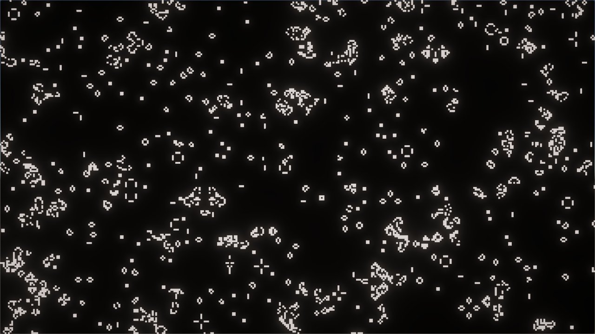

# GameOfLife
This is a pet project where I try various optimization techniques.

It contains some level of abstraction so that it's possible to switch between different implementations with simple GameType enum.
GameType
1) RenderMeshInstanced
2) RenderMeshInstancedWithJobs - Utilizes Jobs System for game algorithm

See also my Twitter thread, when I went into some details of implementing this - 
<blockquote class="twitter-tweet">
I wanted to learn about optimization and profiling in <a href="https://twitter.com/hashtag/Unity?src=hash&amp;ref_src=twsrc%5Etfw">#Unity</a> for some time already and came up with a great project to learn with. So, here I&#39;m creating Conway&#39;s Game Of Life on as large scale as I can manage to optimize. <a href="https://twitter.com/hashtag/GameDev?src=hash&amp;ref_src=twsrc%5Etfw">#GameDev</a> <a href="https://twitter.com/hashtag/Optimization?src=hash&amp;ref_src=twsrc%5Etfw">#Optimization</a> <a href="https://twitter.com/hashtag/GameOfLife?src=hash&amp;ref_src=twsrc%5Etfw">#GameOfLife</a> <a href="https://t.co/Tc1Y5HMgWP">pic.twitter.com/Tc1Y5HMgWP</a>
&mdash; PixelPerfect (@alex_rogatch) <a href="https://twitter.com/alex_rogatch/status/1676458663056162817?ref_src=twsrc%5Etfw">July 5, 2023</a></blockquote> 
